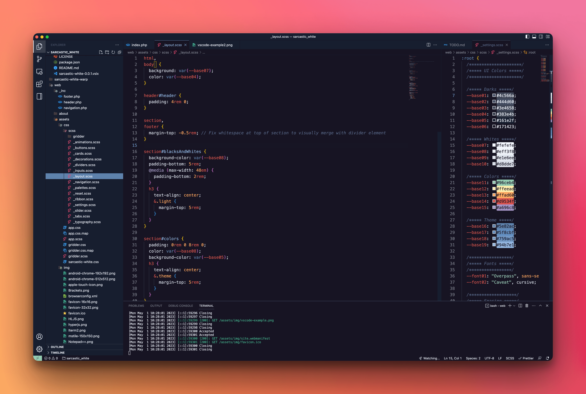

# Sarcastic White Theme

**Sarcastic White** is a color theme that changes the original appearance of editors, terminals and more to a dark blue-ish look and feel.

We've created the theme with a clean and uncluttered design pattern in mind, to achieve optimal focus and readability for code, syntax highlighting and UI components.

## Example from VS Code

## Ports

### Editors

- VS Code
- Sublime Text 4 (Coming soon)
- Nova (Coming soon)
- Brackets (Coming soon)
- TextMate (Coming soon)
- VIM (Coming soon)
- Notepad++ (Coming soon)
- WebStorm (Coming soon)
- PhpStorm (Coming soon)

### Terminals

- Warp
- iTerm2 (Coming soon)
- PuTTY
- hyper.js (Coming soon)

### Syntax Highlighting

- hightlight.js
- rainbow.js
- prism.js (Coming soon)

### Others

- Slack
